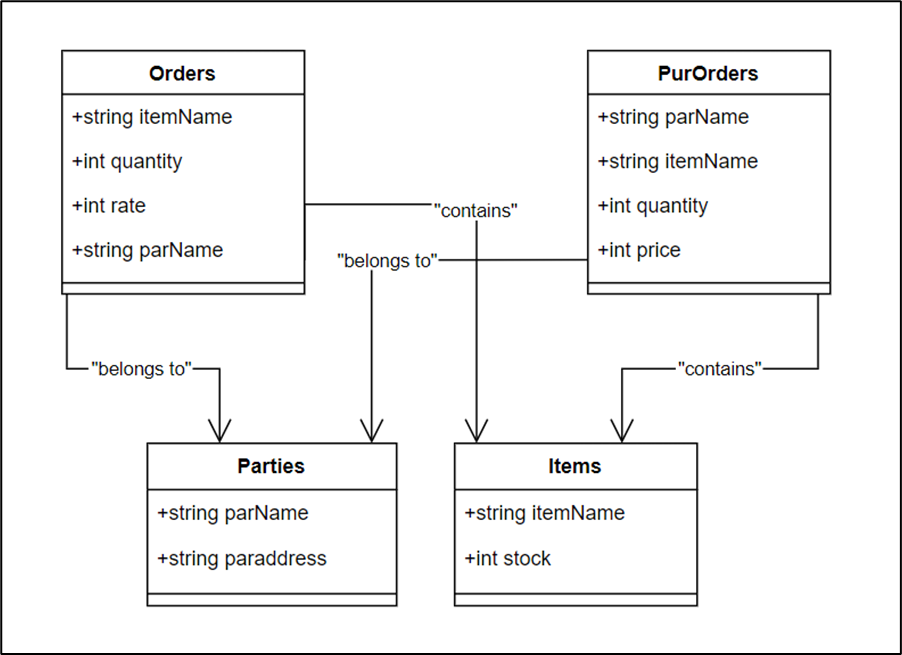
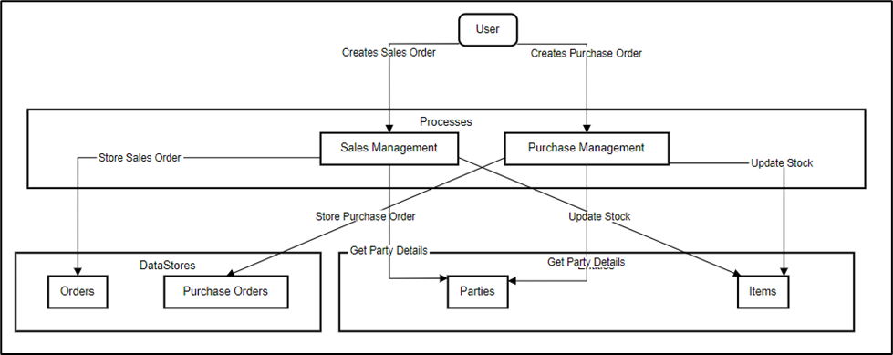
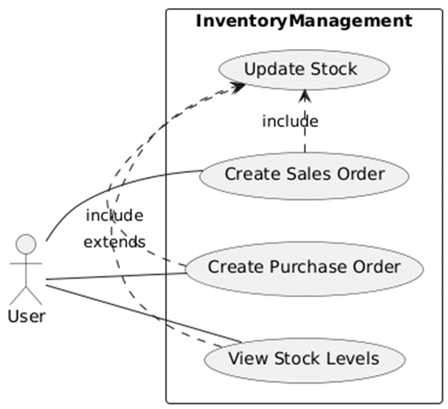
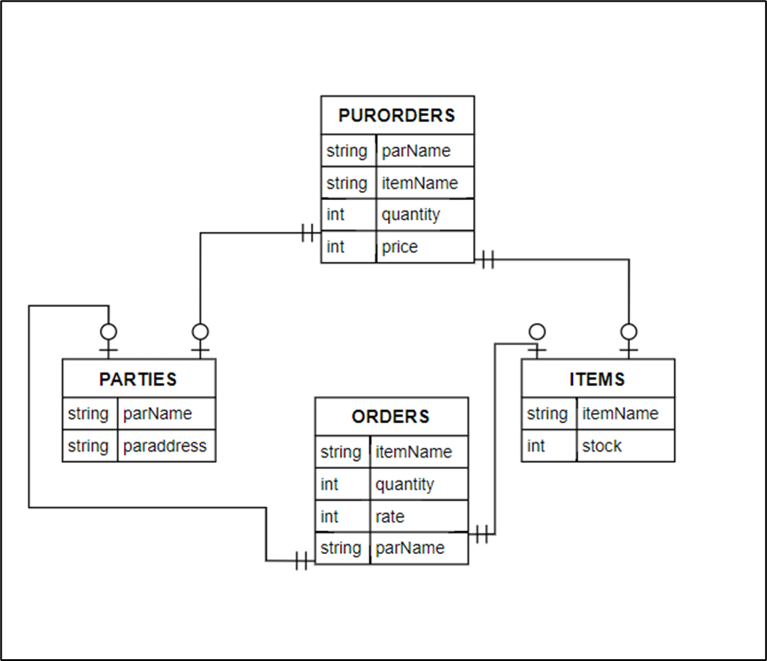

# Project Report

## Project Title: Inventory Management System

---

### By- Mohammed Zaid Malkani (KSBSC IT 034)

---

## Project Title
**Inventory Management System**

## Project Description
The Inventory Management System (IMS) is a robust software application designed to optimize the management of inventory within organizations. Developed using JavaServer Faces (JSF), IMS provides a comprehensive platform for tracking inventory levels, managing orders, and handling supplier information. The system's primary goal is to offer an intuitive, user-friendly interface that simplifies complex inventory processes, ensuring efficient operations and accurate data management.

## Objectives
- To maintain an up-to-date inventory of items.
- To track orders and purchase orders.
- To manage supplier information effectively.
- To provide an intuitive interface for users to interact with the inventory system.

## Benefits
- **Improved Efficiency:** Streamlines inventory processes and reduces manual handling.
- **Enhanced Accuracy:** Provides accurate and up-to-date information on inventory and orders.
- **Better Decision-Making:** Offers comprehensive reporting tools to support strategic planning and operational decisions.

---

## Diagrams:

### Class Diagram:

### Data Flow Diagram:

### Use Case Diagram:

### ER Diagram:

---